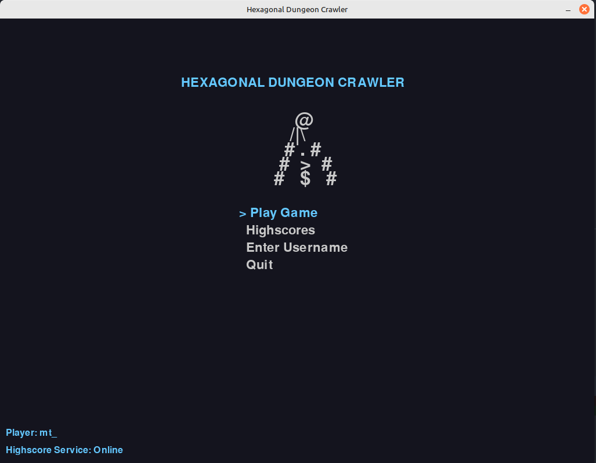
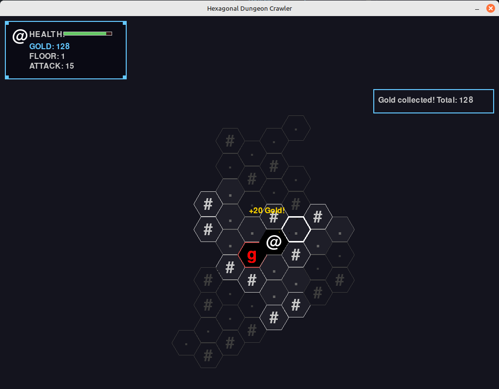
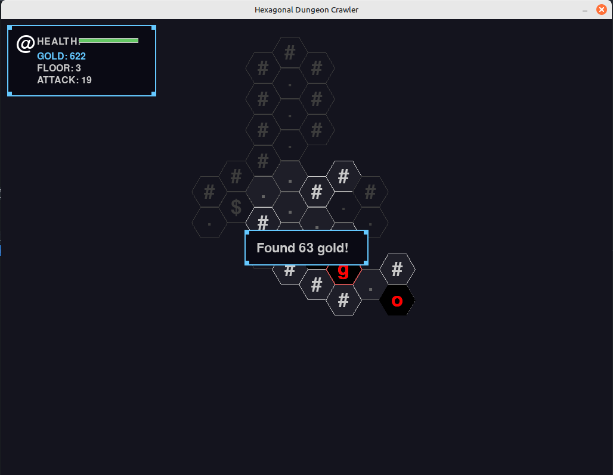
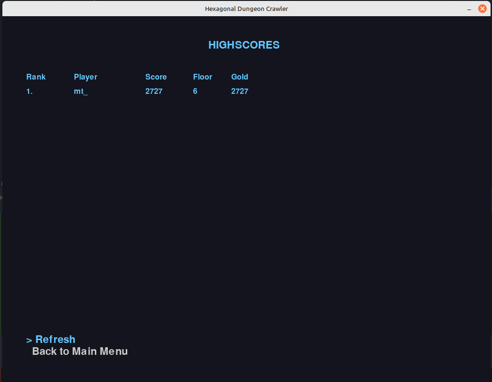

# Hexagonal Dungeon Crawler

A polished turn-based dungeon crawler game built with PyGame featuring hexagonal grid movement, enhanced visual effects, and classic ASCII-style graphics with modern juice.

## 📸 Screenshots

### Main Menu

*Clean, retro-styled main menu with username display and service status*

### Gameplay

*Hexagonal grid-based dungeon exploration with fog of war, enemies, and gold collection*


*Combat encounters and dungeon navigation showing the ASCII-style graphics*

### Highscores

*Comprehensive highscore system with leaderboards and player rankings*

## ✨ Core Features

- **Hexagonal Grid Movement**: Move in 6 directions using click-based controls with smooth animations
- **Nuclear Throne-Style Generation**: Organic dungeon layouts created by random walkers
- **Turn-Based Combat System**: Fight different enemy types with strategic combat
- **Enemy Variety**: Goblins, Orcs, Skeletons, and Trolls with different stats and behaviors
- **Progressive Difficulty**: Higher floors have stronger enemies and better rewards
- **Health & Defense System**: Take and deal damage based on attack and defense stats
- **Gold Collection**: Collect gold from defeated enemies and treasure
- **Multi-Floor Progression**: Descend deeper into the dungeon via stairs
- **Enemy AI**: Enemies wander autonomously and chase the player when detected
- **Fog of War**: Explore the dungeon gradually with limited vision and memory
- **Retro ASCII Graphics**: Classic dungeon crawler aesthetics with polished presentation

## 🎮 Enhanced Visual & Audio Experience

### Juice System

- **Screen Shake**: Dynamic camera shake for impacts and critical hits
- **Hit Flash Effects**: Subtle visual feedback for combat with smooth interpolation
- **Smooth Movement**: Fluid player and enemy movement with easing
- **Particle Effects**: Sparks, debris, and magic effects for all game actions
- **Focus Flash**: Highlighting system for important events
- **Smart Camera**: Intelligent camera following with zoom and smoothing

### Audio System

- **Procedural Sound Generation**: Rich audio created using NumPy waveforms
- **Combat Audio**: Hit sounds, critical strikes, and death effects
- **UI Audio**: Menu navigation and interaction sounds
- **Ambient Audio**: Environmental sounds and magical effects
- **Dynamic Volume**: Contextual audio scaling based on game events
- **Fallback Support**: Graceful degradation when NumPy unavailable

### Visual Effects

- **Particle Systems**: Combat sparks, gold sparkles, death explosions, and magic bursts
- **Lighting Effects**: Dynamic lighting with focus flashes and ambient effects
- **Enhanced Rendering**: Improved tile highlighting and hover effects
- **Smooth Animations**: Interpolated movement and visual transitions

## Controls

- **Movement**: Click on adjacent highlighted hexagonal tiles to move
- **Restart**: Click anywhere or press R when game over
- **God Mode**: Press G to toggle fog of war on/off (for debugging/exploration)
- **Menu Navigation**: Use arrow keys and ENTER in menus
- **Username Entry**: Type your name for highscore tracking
- **Visual Feedback**: Adjacent walkable tiles are highlighted with white borders
- **Hover Effect**: Tiles glow brighter when you hover over them

### Debug & Enhancement Controls

- **F1-F10**: Toggle various juice system effects (screen shake, particles, etc.)
- **F11**: Clear hit flash effects (if disruptive)
- **ESC**: Pause/return to menu during gameplay

## Installation

1. Install Python 3.7 or higher
2. Install dependencies:
   ```bash
   pip install -r requirements.txt
   ```

## Running the Game

### Option 1: Full Experience (with Highscores)

```bash
python start_game.py
```

This starts both the highscore service and the game.

### Option 2: Game Only

```bash
python main.py
```

This runs just the game without highscore functionality.

### Option 3: Service Only

```bash
python highscore_service.py
```

This runs just the highscore web service on port 5000.

## Game Elements

- **Gray Hexagons**: Floor tiles (walkable)
- **Dark Gray Hexagons**: Walls (impassable)
- **Blue Hexagons**: Stairs down to next floor
- **Gold Hexagons**: Gold to collect
- **Red Hexagons**: Enemies (fight automatically when stepped on)
- **Purple Circle**: Your player character

## Enemy Types

- **Goblins** (Red): Weak but common enemies (20 HP, 8 ATK, 2 DEF)
- **Skeletons** (Gray): Fast but fragile (15 HP, 10 ATK, 1 DEF)
- **Orcs** (Dark Red): Balanced fighters (35 HP, 12 ATK, 4 DEF)
- **Trolls** (Brown): Powerful late-game enemies (60 HP, 18 ATK, 8 DEF)

## Enemy Behavior

- **Wandering**: Enemies move randomly when not aware of the player
- **Detection**: Each enemy type has different vision ranges
- **Chasing**: Enemies will pursue the player when detected
- **Different Speeds**: Each enemy type moves at different intervals
  - Skeletons: Fast (1.5s between moves)
  - Goblins: Medium (2.5s between moves)
  - Orcs: Slow (3.0s between moves)
  - Trolls: Very slow (4.0s between moves)

## Procedural Generation

The game uses a **Nuclear Throne-inspired** generation system:

- **Random Walkers**: "FloorMakers" carve out organic dungeon layouts
- **Dynamic Behavior**: Walkers can turn, split, carve rooms, and die based on probabilities
- **Area Types**: Different floor types (Dungeon, Corridors, Caverns) with unique characteristics
- **Organic Layouts**: No rigid room-and-corridor system - naturally flowing spaces
- **Progressive Complexity**: Deeper floors use different generation parameters

### Generation Process:

1. **Floor Carving**: Walkers move through the grid, converting walls to floors
2. **Room Creation**: Walkers occasionally carve out larger open areas
3. **Corridor Splitting**: New walkers spawn to create branching paths
4. **Smart Termination**: Process ends when target floor count is reached
5. **Item Placement**: Stairs placed far from start, gold scattered throughout

## Highscore System

The game features a comprehensive highscore system with web service backend:

- **Flexible Submission**: Scores are preserved and submitted when username is available
- **Username Tracking**: Enter your username to track personal progress (or play as "Anonymous")
- **Retroactive Submission**: Set username after playing to submit previous scores
- **Leaderboards**: View top 10 players and your personal rank
- **Statistics**: Track score, floor reached, gold collected, and enemies defeated
- **Local Service**: Runs locally but designed for easy deployment
- **Offline Mode**: Game works without highscore service
- **Visual Feedback**: Clear submission status indicators

### Highscore Flow:

1. **Play Game** → Score is always preserved
2. **Enter Username** (optional) → Automatic submission
3. **Anonymous Play** → Scores submitted as "Anonymous"
4. **Retroactive Submission** → Username can be set after playing

### Highscore Calculation:

- **Primary Score**: Gold collected
- **Secondary**: Floor reached (for tie-breaking)
- **Additional Stats**: Enemies defeated, total gold

## Gameplay Tips

- Collect gold to increase your score
- Avoid enemies when possible, as they deal damage
- Your health increases when you go to the next floor
- Higher floors have more enemies but also more gold
- Plan your route carefully in the hexagonal grid

## Game Architecture

The game is built with a modular architecture:

### Core Systems

- `main.py` - Entry point and main game loop
- `game/game_engine.py` - Core game logic and state management
- `game/player.py` - Player character with movement and stats
- `game/dungeon.py` - Procedural dungeon generation
- `game/hex_grid.py` - Hexagonal grid mathematics and utilities
- `game/constants.py` - Game configuration and constants

### Enhanced Systems

- `game/juice_manager.py` - Visual effects and game feel management
- `game/particle_system.py` - Particle effects and visual feedback
- `game/audio_system.py` - Procedural sound generation and audio management
- `game/camera_system.py` - Smart camera following and lighting effects
- `game/visual_effects.py` - Hit flashes and visual feedback systems
- `game/movement_system.py` - Smooth movement and animation systems

### UI & Services

- `game/menu_system.py` - Menu navigation and user interface
- `game/highscore_client.py` - Highscore service communication
- `highscore_service.py` - Web service for score tracking
- `start_game.py` - Launcher script for full experience

## Future Enhancements

- Different enemy types with varying difficulty
- Items and equipment system
- Magic spells or special abilities
- Boss fights on certain floors
- Save/load game functionality
- Sound effects and music
- Improved graphics and animations

## Technical Features

### Juice System (F1-F10 to toggle)

- **F1**: Screen shake effects
- **F2**: Particle systems
- **F3**: Hit flash effects
- **F4**: Smooth movement
- **F5**: Audio system
- **F6**: Smart camera
- **F7**: Lighting effects
- **F8**: Visual feedback
- **F9**: Enhanced rendering
- **F10**: Focus flash effects

### Audio Features

- **Procedural Generation**: Complex waveforms with harmonics
- **Event-Driven**: Audio responds to all game actions
- **Dynamic Scaling**: Volume adjusts based on context
- **Fallback Support**: Works with or without NumPy

### Performance

- **Efficient Rendering**: Optimized drawing with culling
- **Smart Updates**: Only update what's changed
- **Memory Management**: Proper cleanup of effects
- **Scalable Effects**: Adjustable quality settings

## 📁 Assets

The `assets/` directory contains game screenshots and documentation:

- `main-menu.png` - Main menu interface screenshot
- `gameplay.png` - Classic gameplay screenshot showing dungeon exploration
- `gameplay-2.png` - Enhanced gameplay screenshot with visual effects
- `highscores.png` - Highscore system interface screenshot

These assets showcase the game's visual progression from classic ASCII graphics to the enhanced juice system with modern effects.

# aws-build-games-challenge
